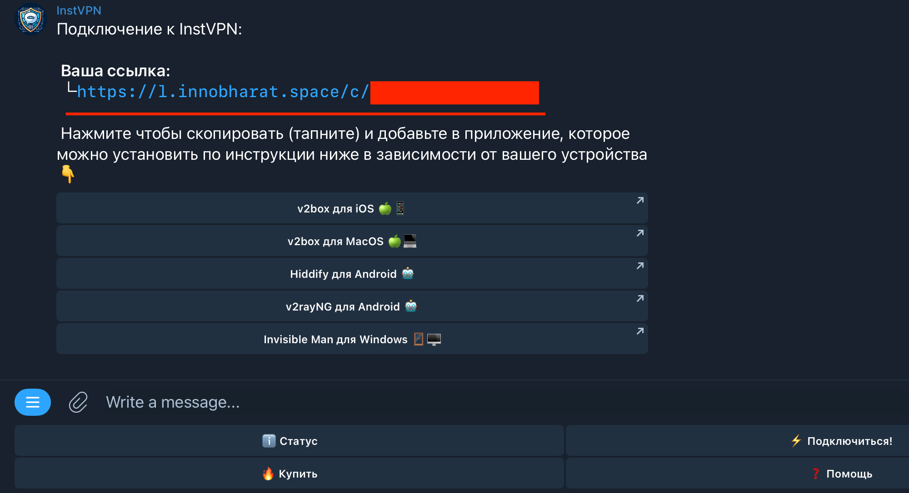
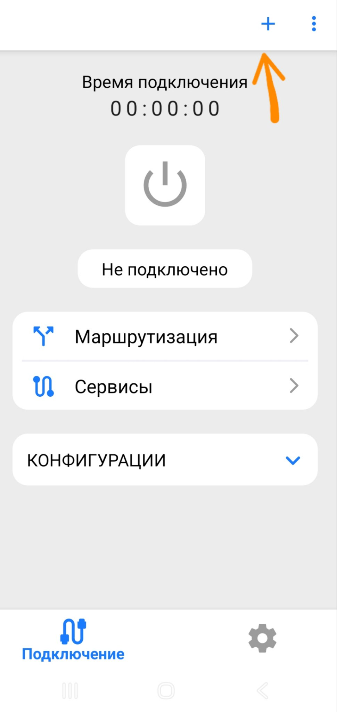
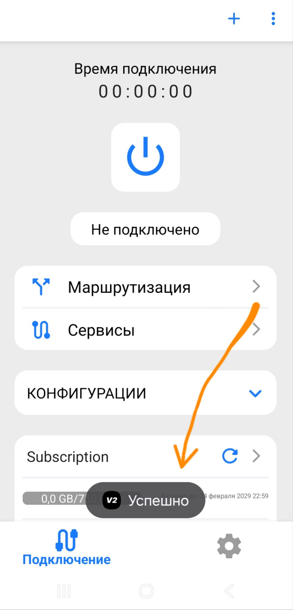
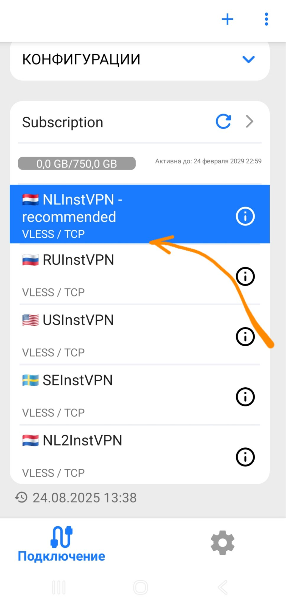
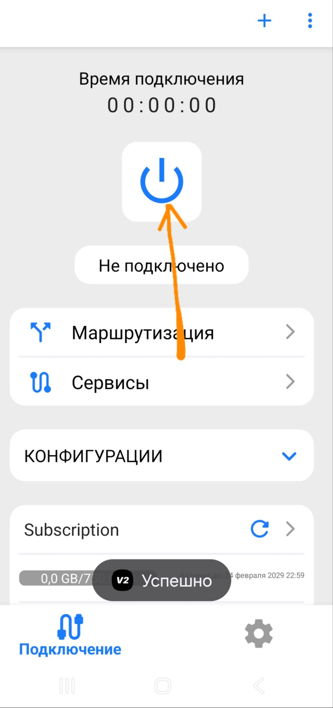
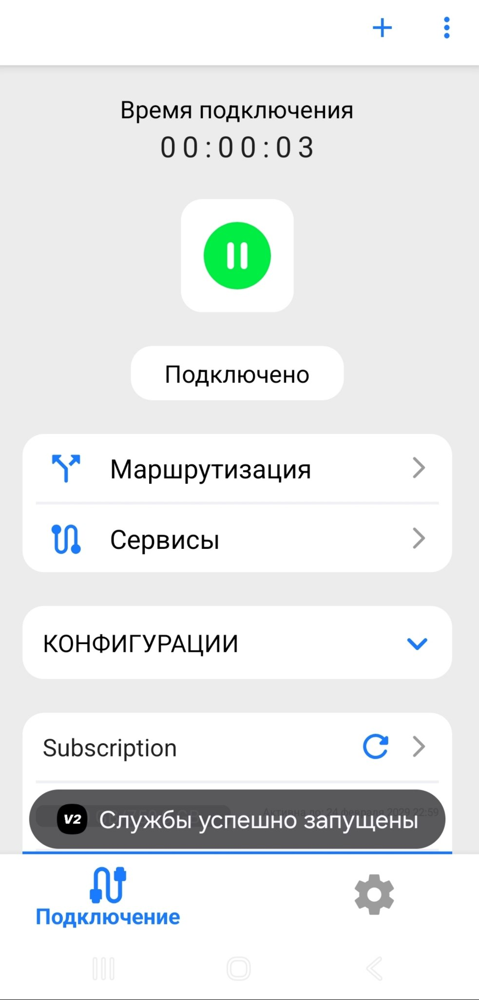
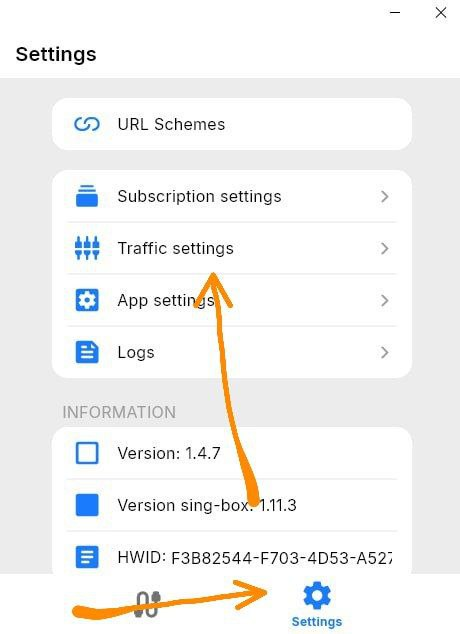
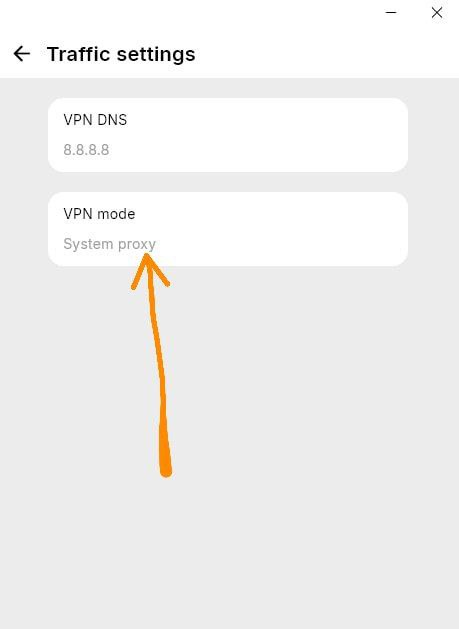

# **Windows-v2RayTun**

Сентябрь 6, 2025

Установка v2RayTun:

**1. Загрузка приложения:**

Скачайте установочный файл https://storage.v2raytun.com/v2RayTun_Setup.exe

Установите приложение "v2RayTun" запустив скачанный файл.

**2. Настройка v2RayTun:**

Запустите приложение v2RayTun.

Скопируйте вашу ссылку для подключения из бота(нажмите кнопку "⚡️ Подключиться!")

Добавление профиля:

Нажмите на значок "+".

Выберите "Добавить из буфера обмена".

Появится новая подписка ниже

Выберите подходящую локацию.

Нажмите кнопку "Подключиться".

Дождитесь изменения статуса на "Подключено".

Вы великолепны! Наслаждайтесь интернетом без ограничений!

Если заблокированные ресурсы не открываются - проверьте настройки:

Попробуйте изменить режим и проверить заново

Если у вас возникли сложности - пожалуйста напишите в техподдержку. Мы поможем. 